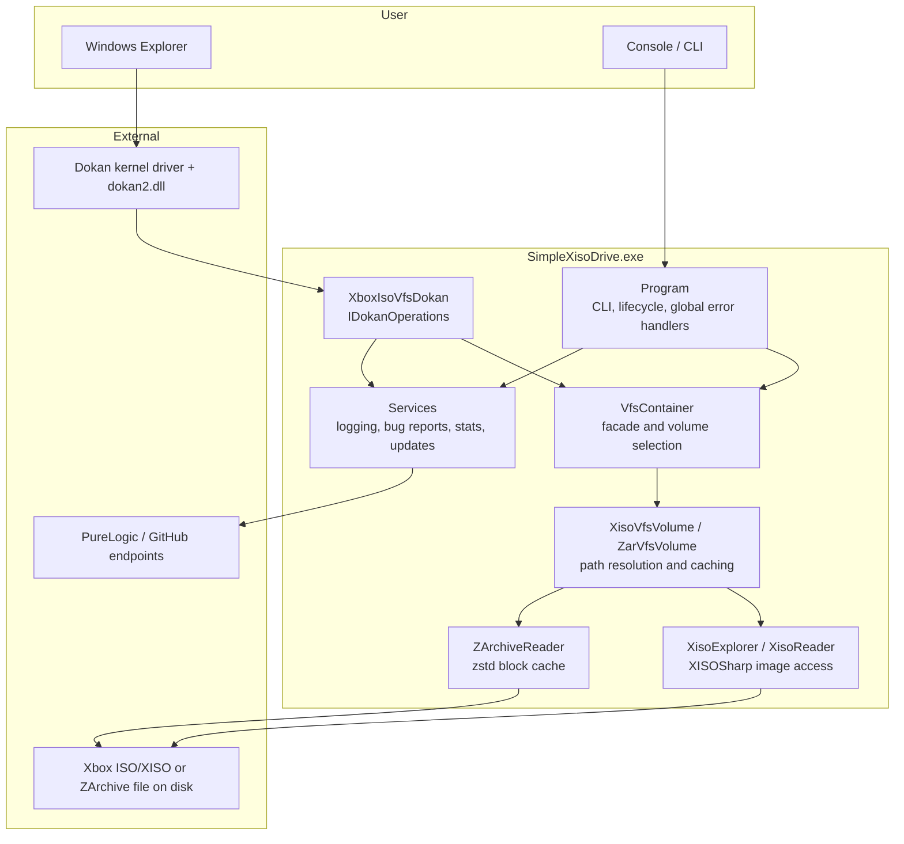
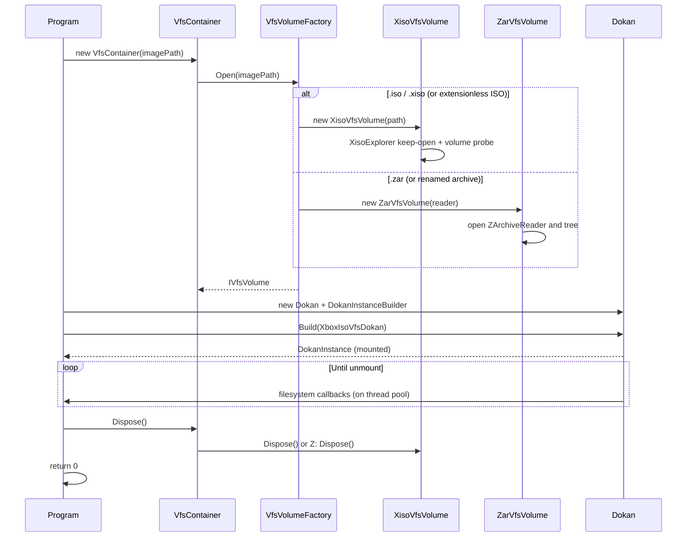

# Architecture

This page describes how SimpleXisoDrive is structured, how a mount is created, and how file
operations flow through the system.

---

## Component overview



---

## Components

| Component | Type | Responsibility |
| --- | --- | --- |
| `Program` | `internal static class` | Entry point, CLI parsing, path resolution, mount lifecycle, console UX, global exception handlers. |
| `VfsContainer` | `public class` | Facade over the selected volume: opens the image through `VfsVolumeFactory` and forwards entry lookups, directory listings, reads, and metadata. Implements `IDisposable`. |
| `IVfsVolume` | `public interface` | The read-only volume contract (size, creation time, label, file-system name, entry lookup, listing, reads). Implemented by `XisoVfsVolume` and `ZarVfsVolume`. |
| `IVfsEntry` | `public interface` | A file or directory entry (name, directory flag, size, Windows attributes). Implemented by the XISO entry type in `XisoVfsVolume` (XDVDFS) and the ZArchive entry type. |
| `VfsVolumeFactory` | `internal static class` | Detects the image format: `.zar` opens as an archive, everything else as an Xbox ISO. Archives with a single embedded XISO file mount that image; otherwise the archived tree mounts directly. |
| `XisoVfsVolume` | `public sealed class` | Opens an Xbox ISO/XISO (path or stream), delegates all parsing to XISOSharp, caches entries and directory listings, and serves file reads. Path-based images use a keep-open `XisoExplorer`; embedded images use `XisoReader` stream APIs. |
| `ZarVfsVolume` | `public sealed class` | Exposes a ZArchive directory tree: resolves paths through `ZArchiveReader`, caches entries, and serves decompressed file data. |
| `ReaderOwningVfsVolume` | `internal sealed class` | Decorates an embedded-XISO volume so the ZArchive reader that backs `ZArchiveReader.OpenRead` is disposed with the volume. |
| `XboxIsoVfsDokan` | `public class` | Implements DokanNet's `IDokanOperations`. Maps Windows file system requests to `VfsContainer` calls, enforces read-only behaviour, and normalizes paths. |
| `XisoExplorer` | `XISOSharp (external)` | Keep-open XISO image handle used by path-based mounts: eager volume probing, directory listing, entry lookup, and bounded file read streams. |
| `XisoReader` | `XISOSharp (external)` | Static stream APIs used for images embedded in archives: volume probing (including rebuilt sector-0 images), directory listing, entry lookup, and raw data reads. |
| `SerilogDokanLogger` | `public sealed class` | Routes DokanNet's internal log messages into Serilog. |
| `InvalidImageException` | `public class` | Signals that a file is not a readable Xbox ISO/XISO image or ZArchive. |

### Services

| Service | Responsibility |
| --- | --- |
| `LoggingSetup` | Builds the global Serilog logger (console + rolling file + bug report sink). |
| `ApiKeyProvider` | Decrypts the double-encrypted API key once at startup for the bug report and stats services. |
| `BugReport` | Builds bug reports, writes `error.log`, sends reports to the remote API, writes `critical_error.log` as a last resort. |
| `BugReportSink` | Serilog sink that forwards Warning and higher events to `BugReport`, with rate limiting. |
| `CheckAccess` | Queries whether the current process has administrator rights. |
| `StatsService` | Fire-and-forget anonymous launch statistics. |
| `UpdateChecker` | Queries GitHub for the latest release and offers to open the release page. |

---

## Startup sequence

1. `Program.Main` configures Serilog via `LoggingSetup.ConfigureLogger`. Failure is non-fatal; the
   application continues without logging.
2. `Program.RunAsync` sets the console theme, clears the screen, and installs two global handlers:
   - `AppDomain.CurrentDomain.UnhandledException`
   - `TaskScheduler.UnobservedTaskException`

   Both route exceptions to `BugReport.LogFatalException`.
3. The application reports launch statistics (`StatsService.ReportLaunchAsync`, fire-and-forget) and
   verifies the Dokan runtime (`%SystemRoot%\System32\dokan2.dll`).
4. `UpdateChecker.CheckForUpdateAsync` runs and may prompt the user.
5. Arguments are parsed and the image path is resolved (see
   [Command-Line Reference](Command-Line-Reference)).
6. `RunMount` builds the `VfsContainer` (which selects an `IVfsVolume` via `VfsVolumeFactory`) and
   mounts the Dokan file system.
7. The process blocks until `Ctrl+C`, a key press (drag-and-drop mode), or a failure.
8. On shutdown the `VfsContainer` is disposed, the file stream is closed, and `Log.CloseAndFlush()`
   is called.

---

## Mount lifecycle



Key points:

- `VfsContainer` construction performs all format validation **before** Dokan is involved, so an
  invalid image fails fast with `InvalidImageException`. A `.zar` archive that embeds a single XISO
  image mounts through `XisoVfsVolume` over `ZArchiveReader.OpenRead`; a directory-tree archive mounts
  through `ZarVfsVolume`.
- Dokan options depend on privileges and flags:
  - always `WriteProtection | CurrentSession`;
  - `MountManager` only when elevated;
  - `DebugMode | StderrOutput` when `--debug` is set.
- Drive letters are normalized from `Z:\` to `Z:` because the Dokan driver rejects the trailing
  backslash form on some versions.

---

## Read path

A typical file read in Explorer becomes:

1. Explorer issues a `ReadFile` request to the Dokan kernel driver.
2. DokanNet dispatches the request to `XboxIsoVfsDokan.ReadFile` on a worker thread.
3. `XboxIsoVfsDokan` uses the `IVfsEntry` stored in `IDokanFileInfo.Context` (or resolves it by path
   if the context is missing), checks that it is not a directory, and clamps the request to the file
   size.
4. `VfsContainer.ReadFile` forwards the request to the active `IVfsVolume`.
5. `XisoVfsVolume` serves the read through XISOSharp. Path-based volumes open a bounded stream with
   `XisoExplorer.OpenReadStream` (CISO-aware, serialized by the explorer's internal lock); embedded
   stream volumes compute the absolute byte offset `DiscLseek + StartSector * 2048 + offset` and
   read directly under the volume's stream lock. `ZarVfsVolume` calls `ZArchiveReader.ReadFromFile`,
   which resolves the covering 64 KiB block(s), decompresses them through a 4 MiB LRU cache, and
   copies the requested range.
6. The number of bytes read is returned to Dokan, which hands the buffer to the kernel.

Reads are streamed directly from the image; only the ZAR block cache (64 blocks, 4 MiB) keeps
decompressed data in memory.

---

## Caching and traversal

The active volume implementation maintains two per-instance caches:

| Cache | Key | Value |
| --- | --- | --- |
| Entry cache | Normalized virtual path (`\Games\Halo\default.xbe`) | Entry (XISO entry for XISO images, ZArchive node for ZAR) |
| Children cache | Normalized directory path | List of entries |

For XISO images, directory listings come from XISOSharp's hardened TOC walk: the visited offset set
prevents cycles, each directory table is capped at a fixed number of entries, and separator-bearing
file names abort the walk. The volume itself caches entries and child lists in concurrent
dictionaries, so repeated lookups and re-listings are served without touching the image.

For ZArchive trees, children come from the flat file tree in the archive. The volume caps each
directory at 100,000 enumerated entries (the underlying reader validates node counts against the
table), takes child node handles directly from `TryGetDirEntry` (the library clamps crafted counts),
and caches entries as they are discovered.

`XisoExplorer` in keep-open mode serializes its operations on an internal lock, so concurrent Dokan
requests cannot interleave seeks; the stream-backed XISO volume guards its held stream with its own
lock. `ZArchiveReader` is internally thread-safe (single lock plus a 4 MiB LRU block cache); both
volume caches are concurrent dictionaries.

---

## Error handling strategy

The application uses a layered approach:

| Layer | Strategy |
| --- | --- |
| XISOSharp (`XisoExplorer` / `XisoReader`) | Signals invalid images with `XisoFormatException`/`InvalidDataException`; the volume translates them. |
| `XisoVfsVolume` / `ZarVfsVolume` | Catch failures per operation, log, return `null`/empty. Construction failures are wrapped in `InvalidImageException`. |
| `XboxIsoVfsDokan` | Every public operation is wrapped by `ExecuteWithReporting`, which logs the failing operation and returns `DokanResult.Error` instead of propagating. |
| `Program` | Converts known exceptions (`InvalidImageException`, `DokanException`, `DllNotFoundException`) into user-facing guidance and returns exit code `1`. |
| Global handlers | Unhandled and unobserved exceptions are written to `error.log` and reported through the remote bug report API when configured. |

Because `BugReportSink` is attached at Warning level, any error logged through Serilog is also
persisted to `error.log` and, if configured, forwarded to the developer API. See
[Privacy and Networking](Privacy-and-Networking).

---

## Threading model

- Dokan invokes callbacks on thread pool threads; multiple operations can be in flight at once.
- All access to the shared image handle is guarded: a keep-open `XisoExplorer` serializes its
  operations on an internal lock, and the stream-backed XISO volume locks its held stream. ZArchive
  reads are serialized inside `ZArchiveReader` with its own lock.
- The mount initialization itself runs on the main async flow; the process then waits on a
  `TaskCompletionSource` registered with the cancellation token.
- `Ctrl+C` is handled by cancelling the token; the cancellation is cooperative and triggers a clean
  unmount rather than an abrupt exit.

---

## Repository layout

```text
CSharp_SimpleXisoDrive/
|-- CSharp_SimpleXisoDrive.sln
|-- global.json                        # .NET SDK 10.0.0, rollForward latestMajor
|-- ReadMe.md
|-- .editorconfig                      # analyzer rule suppressions
|-- docs/                              # this documentation
|-- SimpleXisoDrive/                   # application project
|   |-- Program.cs
|   |-- VfsContainer.cs                # facade over the selected volume
|   |-- XboxIsoVfsDokan.cs
|   |-- SerilogDokanLogger.cs
|   |-- InvalidImageException.cs
|   |-- AssemblyInfo.cs                # InternalsVisibleTo for the test project
|   |-- Services/
|   |   |-- LoggingSetup.cs
|   |   |-- BugReport.cs
|   |   |-- BugReportSink.cs
|   |   |-- CheckAccess.cs
|   |   |-- StatsService.cs
|   |   `-- UpdateChecker.cs
|   |-- Vfs/
|   |   |-- IVfsEntry.cs               # entry contract
|   |   |-- IVfsVolume.cs              # volume contract
|   |   |-- VfsVolumeFactory.cs        # format detection (.iso/.xiso/.zar)
|   |   |-- XisoVfsVolume.cs           # XDVDFS image volume
|   |   |-- ZarVfsVolume.cs            # ZArchive tree volume
|   |   `-- ReaderOwningVfsVolume.cs   # closes the reader with an embedded-ISO mount
|   `-- icon/xiso.ico, icon/xiso.png
`-- SimpleXisoDrive.Tests/            # xUnit test project
    |-- InvalidImageExceptionTests.cs
    |-- ResolveImagePathTests.cs
    |-- TestImageFactory.cs
    |-- VfsContainerTests.cs
    |-- XisoVfsVolumeTests.cs
    `-- ZarVfsVolumeTests.cs
```

---

## Dependencies

| Package | Version | Purpose |
| --- | --- | --- |
| `DokanNet` | 2.3.0.3 | Managed wrapper over the Dokan user-mode file system library. |
| `Serilog` | 4.4.0 | Structured logging core. |
| `Serilog.Sinks.Console` | 6.1.1 | Console log output. |
| `Serilog.Sinks.File` | 7.0.0 | Rolling file log output. |
| `XISOSharp` | 1.2.0 | Xbox ISO/XISO image access: volume probing (including rebuilt sector-0 images), directory traversal, and file reads for the XISO volume. |
| `ZArchiveSharp` | 1.3.0 | Pure-C# ZArchive reader/writer; the mount-friendly 1.3.0 reader API (node handles, entry streams, failure reasons) is used to mount `.zar` volumes. |
| `Meziantou.Analyzer` | 3.0.257 | Build-time code analyzers. |
| `Roslynator.Analyzers` | 5.0.0 | Build-time code analyzers. |

Test project: `Microsoft.NET.Test.Sdk` 18.10.0, `xunit` 2.9.3, `xunit.runner.visualstudio` 4.0.0,
`coverlet.collector` 10.0.1.

---

## Design decisions

- **Read-only by construction.** No mutation path exists in the VFS layer; Dokan operations that
  would modify state return `DokanResult.AccessDenied` directly.
- **Validate before mounting.** Format detection and validation happen in `VfsVolumeFactory` and the
  volume constructors, so the user gets a clear error before a drive letter is consumed.
- **Parsing delegated to XISOSharp.** The application no longer reads XDVDFS bytes itself; volume
  probing, TOC walking, and attribute mapping come from the library, so fixes and hardening apply to
  every consumer at once.
- **Fail-safe traversal.** Cycle detection and per-table entry limits protect against malformed or
  malicious images rather than trusting the tree structure.
- **Stream, do not load.** File content is read on demand and never cached; ZAR blocks are
  decompressed individually through a small bounded cache, keeping memory usage independent of
  image size.
- **Log-and-continue at the edges.** Internal failures are contained and surfaced as I/O errors to
  Windows, keeping the mounted volume stable for other files.
