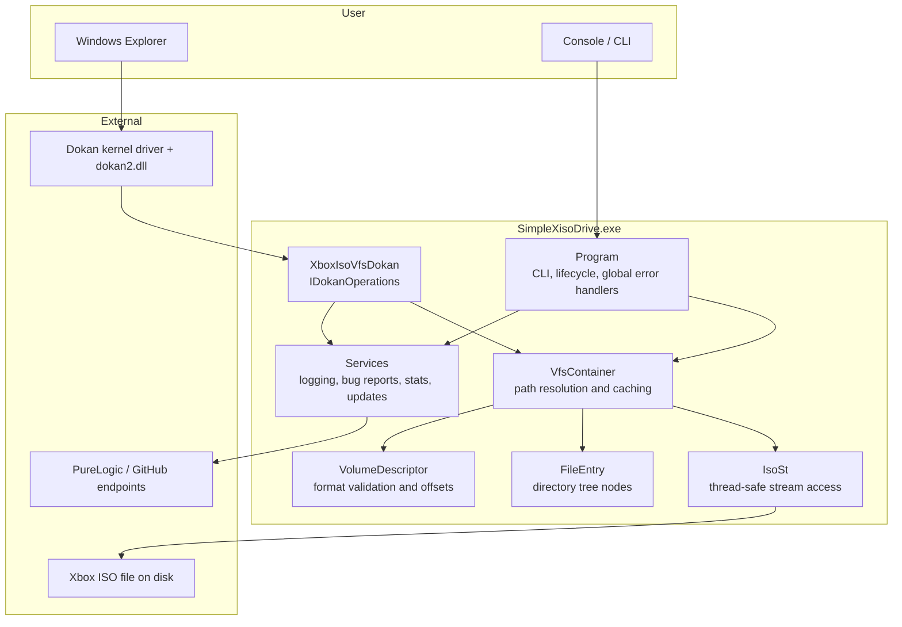
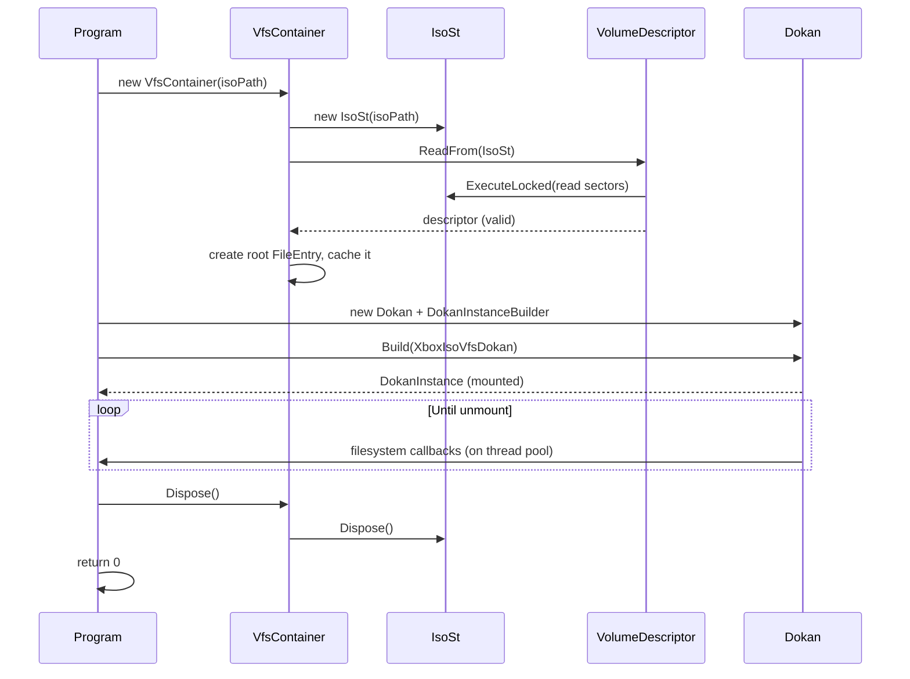

# Architecture

This page describes how SimpleXisoDrive is structured, how a mount is created, and how file
operations flow through the system.

---

## Component overview



---

## Components

| Component | Type | Responsibility |
| --- | --- | --- |
| `Program` | `internal static class` | Entry point, CLI parsing, path resolution, mount lifecycle, console UX, global exception handlers. |
| `VfsContainer` | `public class` | Opens the image, reads and validates the volume descriptor, resolves paths to `FileEntry` objects, caches directory listings, serves file reads. Implements `IDisposable`. |
| `XboxIsoVfsDokan` | `public class` | Implements DokanNet's `IDokanOperations`. Maps Windows file system requests to `VfsContainer` calls, enforces read-only behaviour, and normalizes paths. |
| `IsoSt` | `public class` | Owns the `FileStream` and `BinaryReader` over the ISO, serializes all stream access with a lock, applies the volume offset, and reads raw sectors and directory entries. Implements `IDisposable`. |
| `VolumeDescriptor` | `public sealed class` | Reads and validates the XDVDFS volume descriptor from all known locations, detects the image variant, and stores the root directory table sector and creation time. |
| `FileEntry` | `public class` | Represents one node in the XDVDFS directory binary tree: child pointers, data location and size, attributes, name, and on-disk entry size. |
| `XisoFsFileAttributes` | `public enum` | XDVDFS attribute flags (`ReadOnly`, `Hidden`, `System`, `Directory`, `Archive`, `Normal`). |
| `SerilogDokanLogger` | `public sealed class` | Routes DokanNet's internal log messages into Serilog. |
| `InvalidImageException` | `public class` | Signals that a file is not a readable Xbox ISO image or that its descriptor is invalid. |

### Services

| Service | Responsibility |
| --- | --- |
| `LoggingSetup` | Builds the global Serilog logger (console + rolling file + bug report sink). |
| `BugReport` | Builds bug reports, writes `error.log`, sends reports to the remote API, writes `critical_error.log` as a last resort. |
| `BugReportSink` | Serilog sink that forwards Warning and higher events to `BugReport`, with rate limiting. |
| `CheckAccess` | Queries whether the current process has administrator rights. |
| `StatsService` | Fire-and-forget anonymous launch statistics. |
| `UpdateChecker` | Queries GitHub for the latest release and offers to open the release page. |

---

## Startup sequence

1. `Program.Main` configures Serilog via `LoggingSetup.ConfigureLogger`. Failure is non-fatal; the
   application continues without logging.
2. `Program.RunAsync` sets the console theme, clears the screen, and installs two global handlers:
   - `AppDomain.CurrentDomain.UnhandledException`
   - `TaskScheduler.UnobservedTaskException`

   Both route exceptions to `BugReport.LogFatalException`.
3. The application reports launch statistics (`StatsService.ReportLaunchAsync`, fire-and-forget) and
   verifies the Dokan runtime (`%SystemRoot%\System32\dokan2.dll`).
4. `UpdateChecker.CheckForUpdateAsync` runs and may prompt the user.
5. Arguments are parsed and the ISO path is resolved (see
   [Command-Line Reference](Command-Line-Reference)).
6. `RunMount` builds the `VfsContainer` and mounts the Dokan file system.
7. The process blocks until `Ctrl+C`, a key press (drag-and-drop mode), or a failure.
8. On shutdown the `VfsContainer` is disposed, the file stream is closed, and `Log.CloseAndFlush()`
   is called.

---

## Mount lifecycle



Key points:

- `VfsContainer` construction performs all format validation **before** Dokan is involved, so an
  invalid image fails fast with `InvalidImageException`.
- Dokan options depend on privileges and flags:
  - always `WriteProtection | CurrentSession`;
  - `MountManager` only when elevated;
  - `DebugMode | StderrOutput` when `--debug` is set.
- Drive letters are normalized from `Z:\` to `Z:` because the Dokan driver rejects the trailing
  backslash form on some versions.

---

## Read path

A typical file read in Explorer becomes:

1. Explorer issues a `ReadFile` request to the Dokan kernel driver.
2. DokanNet dispatches the request to `XboxIsoVfsDokan.ReadFile` on a worker thread.
3. `XboxIsoVfsDokan` uses the `FileEntry` stored in `IDokanFileInfo.Context` (or resolves it by path
   if the context is missing), checks that it is not a directory, and clamps the request to the file
   size.
4. `VfsContainer.ReadFile` forwards the request to `IsoSt.Read`.
5. `IsoSt.Read` computes the absolute byte offset
   `VolumeOffset + StartSector * 2048 + offset`, seeks, and reads into the caller's span while
   holding the stream lock.
6. The number of bytes read is returned to Dokan, which hands the buffer to the kernel.

Reads are streamed directly from the ISO; no cache of file contents exists in the application.

---

## Caching and traversal

`VfsContainer` maintains two per-instance caches:

| Cache | Key | Value |
| --- | --- | --- |
| Entry cache | Normalized virtual path (`\Games\Halo\default.xbe`) | `FileEntry` |
| Children cache | Normalized directory path | `List<FileEntry>` |

Directory listings are produced by traversing the XDVDFS binary tree iteratively with an explicit
stack. To survive corrupted images:

- every visited node is tracked by `(EntrySector, EntryOffset)`;
- a hard iteration limit of 100,000 nodes applies to each traversal;
- exceeding the limit is logged as an error and the traversal stops.

`IsoSt` serializes all stream operations on a single lock object, so concurrent Dokan requests cannot
interleave seeks. The `VfsContainer` caches are plain dictionaries populated during traversal.

---

## Error handling strategy

The application uses a layered approach:

| Layer | Strategy |
| --- | --- |
| `IsoSt` | Never throws from public read paths; logs and returns `0`/`null`. |
| `VfsContainer` | Catches failures per operation, logs, returns `null`/empty. Construction failures are wrapped in `InvalidImageException`. |
| `XboxIsoVfsDokan` | Every public operation is wrapped by `ExecuteWithReporting`, which logs the failing operation and returns `DokanResult.Error` instead of propagating. |
| `Program` | Converts known exceptions (`InvalidImageException`, `DokanException`, `DllNotFoundException`) into user-facing guidance and returns exit code `1`. |
| Global handlers | Unhandled and unobserved exceptions are written to `error.log` and reported through the remote bug report API when configured. |

Because `BugReportSink` is attached at Warning level, any error logged through Serilog is also
persisted to `error.log` and, if configured, forwarded to the developer API. See
[Privacy and Networking](Privacy-and-Networking).

---

## Threading model

- Dokan invokes callbacks on thread pool threads; multiple operations can be in flight at once.
- All access to the shared `FileStream`/`BinaryReader` is guarded by `IsoSt.LockObject`, making
  sector reads and directory-entry reads atomic with respect to each other.
- The mount initialization itself runs on the main async flow; the process then waits on a
  `TaskCompletionSource` registered with the cancellation token.
- `Ctrl+C` is handled by cancelling the token; the cancellation is cooperative and triggers a clean
  unmount rather than an abrupt exit.

---

## Repository layout

```text
CSharp_SimpleXisoDrive/
|-- CSharp_SimpleXisoDrive.sln
|-- global.json                        # .NET SDK 10.0.0, rollForward latestMajor
|-- ReadMe.md
|-- .editorconfig                      # analyzer rule suppressions
|-- docs/                              # this documentation
|-- SimpleXisoDrive/                   # application project
|   |-- Program.cs
|   |-- VfsContainer.cs
|   |-- XboxIsoVfsDokan.cs
|   |-- SerilogDokanLogger.cs
|   |-- InvalidImageException.cs
|   |-- AssemblyInfo.cs                # InternalsVisibleTo for the test project
|   |-- Models/XisoFsFileAttributes.cs
|   |-- Services/
|   |   |-- LoggingSetup.cs
|   |   |-- BugReport.cs
|   |   |-- BugReportSink.cs
|   |   |-- CheckAccess.cs
|   |   |-- StatsService.cs
|   |   `-- UpdateChecker.cs
|   |-- XDVDFs/
|   |   |-- IsoSt.cs
|   |   |-- VolumeDescriptor.cs
|   |   `-- FileEntry.cs
|   `-- icon/xiso.ico, icon/xiso.png
`-- SimpleXisoDrive.Tests/            # xUnit test project
    |-- FileEntryTests.cs
    |-- InvalidImageExceptionTests.cs
    |-- IsoStTests.cs
    |-- ResolveIsoPathTests.cs
    |-- VolumeDescriptorTests.cs
    `-- XisoFsFileAttributesTests.cs
```

---

## Dependencies

| Package | Version | Purpose |
| --- | --- | --- |
| `DokanNet` | 2.3.0.3 | Managed wrapper over the Dokan user-mode file system library. |
| `Serilog` | 4.4.0 | Structured logging core. |
| `Serilog.Sinks.Console` | 6.1.1 | Console log output. |
| `Serilog.Sinks.File` | 7.0.0 | Rolling file log output. |
| `XISOSharp` | 1.0.2 | Referenced package (XISO tooling). |
| `ZArchiveSharp` | 1.2.2 | Referenced package (archive handling). |
| `Meziantou.Analyzer` | 3.0.257 | Build-time code analyzers. |
| `Roslynator.Analyzers` | 5.0.0 | Build-time code analyzers. |

Test project: `Microsoft.NET.Test.Sdk` 18.10.0, `xunit` 2.9.3, `xunit.runner.visualstudio` 4.0.0,
`coverlet.collector` 10.0.1.

---

## Design decisions

- **Read-only by construction.** No mutation path exists in the VFS layer; Dokan operations that
  would modify state return `DokanResult.AccessDenied` directly.
- **Validate before mounting.** Format validation happens in `VfsContainer` construction so the user
  gets a clear error before a drive letter is consumed.
- **Fail-safe traversal.** Cycle detection and iteration limits protect against malformed or
  malicious images rather than trusting the tree structure.
- **Stream, do not load.** File content is read on demand and never cached, keeping memory usage
  independent of ISO size.
- **Log-and-continue at the edges.** Internal failures are contained and surfaced as I/O errors to
  Windows, keeping the mounted volume stable for other files.
