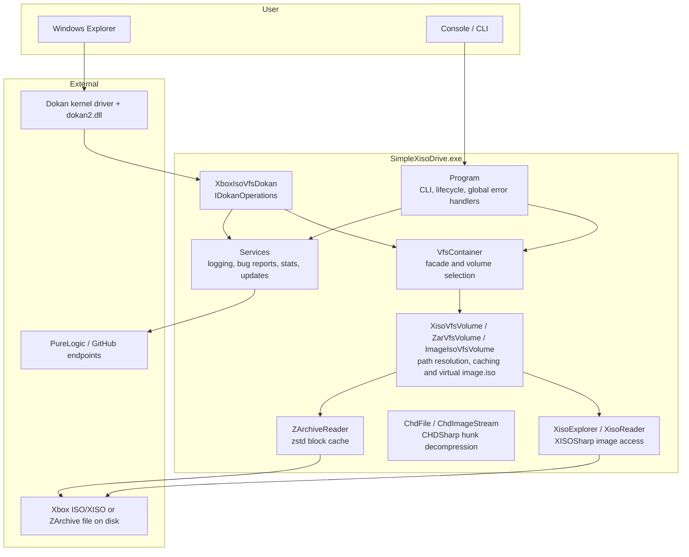
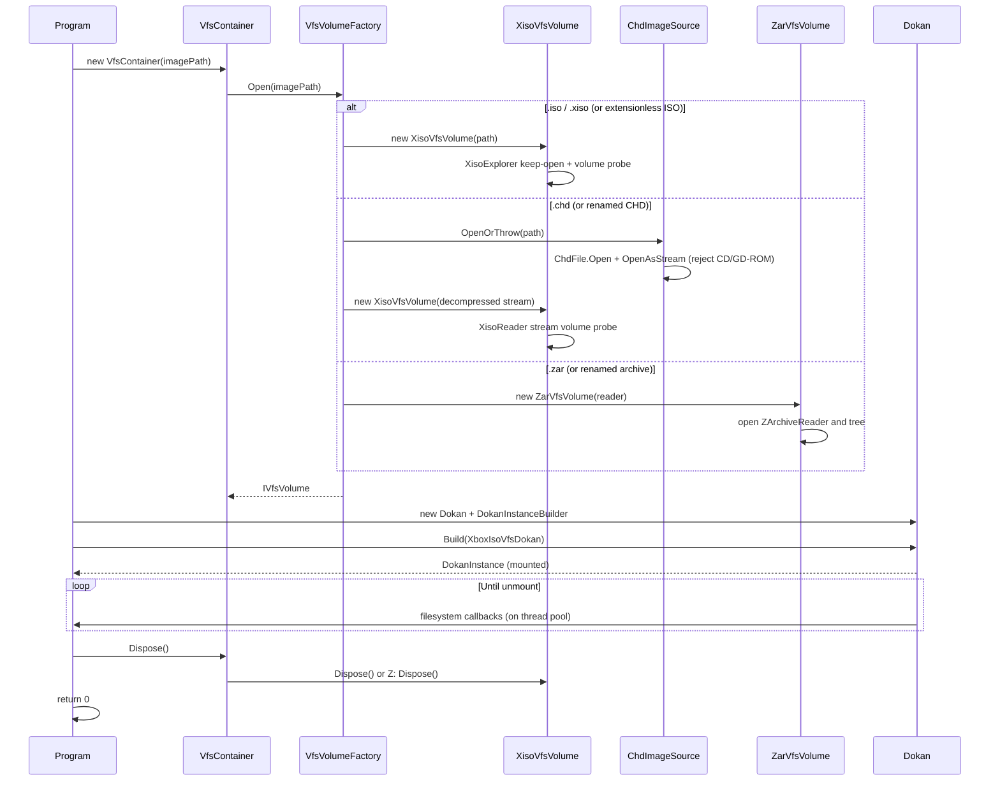

# Architecture

This page describes how SimpleXisoDrive is structured, how a mount is created, and how file
operations flow through the system.

The application is split into a shared core (`SimpleXisoDrive.Core`), a standalone FUSE 3 mount
library (`FuseSharp`) and two front ends: the Windows Dokan app (`SimpleXisoDrive`) and the
Linux/macOS FUSE 3 app (`SimpleXisoDrive.Unix`). The core owns image parsing, the virtual file
system and the services; the front ends only implement the mount backend, the command line and the
platform UX. The diagram below shows the Windows front end; the Unix front end replaces
`XboxIsoVfsDokan`/`Dokan` with `FuseSharp`'s `FuseFileSystem`/`FuseInterop` over `libfuse3`/macFUSE,
and `DriveLetterSelector` with temporary mount directories.

---

## Component overview


```mermaid
flowchart TD
    subgraph User["User"]
        Explorer["Windows Explorer"]
        Console["Console / CLI"]
    end

    subgraph App["SimpleXisoDrive.exe"]
        Program["Program<br/>CLI, lifecycle, global error handlers"]
        DokanOps["XboxIsoVfsDokan<br/>IDokanOperations"]
        Vfs["VfsContainer<br/>facade and volume selection"]
        Volumes["XisoVfsVolume / ZarVfsVolume / ImageIsoVfsVolume<br/>path resolution, caching and virtual image.iso"]
        Xiso["XisoExplorer / XisoReader<br/>XISOSharp image access"]
        Chd["ChdFile / ChdImageStream<br/>CHDSharp hunk decompression"]
        Zar["ZArchiveReader<br/>zstd block cache"]
        Services["Services<br/>logging, bug reports, stats, updates"]
    end

    subgraph External["External"]
        Dokan["Dokan kernel driver + dokan2.dll"]
        Image["Xbox ISO/XISO or ZArchive file on disk"]
        Api["PureLogic / GitHub endpoints"]
    end

    Explorer --> Dokan
    Console --> Program
    Dokan --> DokanOps
    DokanOps --> Vfs
    Vfs --> Volumes
    Volumes --> Xiso
    Volumes --> Zar
    Xiso --> Image
    Zar --> Image
    Program --> Vfs
    Program --> Services
    DokanOps --> Services
    Services --> Api
```

---

## Components

| Component | Type | Responsibility |
| --- | --- | --- |
| `Program` | `internal static class` | Entry point, CLI parsing, path resolution, mount lifecycle, console UX, global exception handlers. |
| `VfsContainer` | `public class` | Facade over the selected volume: opens the image through `VfsVolumeFactory` and forwards entry lookups, directory listings, reads, and metadata. Implements `IDisposable`. |
| `IVfsVolume` | `public interface` | The read-only volume contract (size, creation time, label, file-system name, entry lookup, listing, reads). Implemented by `XisoVfsVolume`, `ZarVfsVolume` and `ImageIsoVfsVolume`. |
| `IVfsEntry` | `public interface` | A file or directory entry (name, directory flag, size, Windows attributes). Implemented by the XISO entry type in `XisoVfsVolume` (XDVDFS), the ZArchive entry type, and the synthetic entry in `ImageIsoVfsVolume`. |
| `VfsVolumeFactory` | `internal static class` | Detects the image format: `.zar` opens as an archive, `.chd` opens through CHDSharp, everything else as an Xbox ISO (with a CHD/ZArchive magic fallback for renamed files). Archives with a single embedded XISO file mount that image; otherwise the archived tree mounts directly. With `--image-iso` it wraps the volume in `ImageIsoVfsVolume`, synthesizing a virtual XISO for a ZArchive tree when needed. |
| `XisoVfsVolume` | `internal sealed class` | Opens an Xbox ISO/XISO (path or stream), delegates all parsing to XISOSharp, caches entries and directory listings, and serves file reads. Path-based images use a keep-open `XisoExplorer`; embedded images and decompressed CHD images use `XisoReader` stream APIs. |
| `ChdImageSource` | `internal static class` | Opens an Xbox ISO CHD with CHDSharp (`ChdFile.Open` + `ChdFile.OpenAsStream`), rejects CD/GD-ROM CHDs up front, and returns a `ChdImageStream` over the decompressed image. The decompressed image must then parse as XDVDFS before the mount succeeds. |
| `ZarVfsVolume` | `internal sealed class` | Exposes a ZArchive directory tree: resolves paths through `ZArchiveReader`, caches entries, and serves decompressed file data. |
| `ReaderOwningVfsVolume` | `internal sealed class` | Decorates an embedded-XISO volume so the ZArchive reader that backs `ZArchiveReader.OpenRead` is disposed with the volume. |
| `ImageIsoVfsVolume` | `internal sealed class` | Decorator enabled by `--image-iso`: adds a virtual read-only `image.iso` file at the volume root, backed by `IRawImageSource`, while the normal tree stays browsable. |
| `IRawImageSource` / `StreamRawImageSource` | `internal` | Reads raw image bytes at an offset from a seekable stream (plain ISO, CISO block device, decompressed CHD, or embedded XISO) or from the in-memory virtual XISO layout. Reads are serialized for Dokan's concurrent callbacks. |
| `VirtualXisoImageSource` | `internal sealed class` | Synthesizes an XISO for a ZArchive directory tree entirely in memory: builds the directory tables with `DirectoryEntryTableWriter`, allocates sectors with `SectorAllocator`, emits the volume descriptor/ECMA-119 header/optimized tag, and serves file data from the archive on demand. No extraction, no temporary files. |
| `XboxIsoVfsDokan` | `internal sealed class` (Windows) | Implements DokanNet's `IDokanOperations`. Maps Windows file system requests to `VfsContainer` calls, enforces read-only behaviour, and normalizes paths. |
| `FuseFileSystem` | `public sealed class` (FuseSharp) | Mounts an `IFuseVolume` through the FUSE 3 high-level API: `getattr`/`open`/`read`/`statfs`/`readdir`/`init` callbacks for Linux and macOS, read-only enforcement, and signal-driven unmounting through `fuse_exit`. |
| `FuseInterop` | `internal static class` (FuseSharp) | Platform-aware P/Invoke layer: resolves and loads `libfuse3`/macFUSE, declares the Linux and macOS `fuse_operations` layouts, picks the exported `fuse_new` entry point per platform, and pokes the mount with `statfs` to wake the loop. |
| `FuseAvailability` | `public static class` (FuseSharp) | Probes the FUSE library, `/dev/fuse` and `fusermount3`, and prints installation guidance when FUSE is missing. |
| `IFuseVolume` / `IFuseEntry` | `public interface` (FuseSharp) | The read-only volume contract consumed by `FuseFileSystem`: POSIX-path entry lookup, directory listing and file reads, plus label, creation time and size. |
| `FuseVolumeAdapter` | `internal sealed class` (Unix) | Adapts an `IVfsVolume` (backslash-separated VFS paths) to `IFuseVolume`, translating paths and wrapping entries. |
| `XisoExplorer` | `XISOSharp (external)` | Keep-open XISO image handle used by path-based mounts: eager volume probing, directory listing, entry lookup, and bounded file read streams. |
| `XisoReader` | `XISOSharp (external)` | Static stream APIs used for images embedded in archives: volume probing (including rebuilt sector-0 images), directory listing, entry lookup, and raw data reads. |
| `SerilogDokanLogger` | `internal sealed class` | Routes DokanNet's internal log messages into Serilog. |
| `InvalidImageException` | `public class` | Signals that a file is not a readable Xbox ISO/XISO image, Xbox ISO CHD or ZArchive. |

### Services

| Service | Responsibility |
| --- | --- |
| `LoggingSetup` | Builds the global Serilog logger (console + rolling file + bug report sink). |
| `ApiKeyProvider` | Decrypts the double-encrypted API key once at startup for the bug report and stats services. |
| `BugReport` | Builds bug reports, writes `error.log`, sends reports to the remote API, writes `critical_error.log` as a last resort. |
| `BugReportSink` | Serilog sink that forwards Warning and higher events to `BugReport`, with rate limiting. |
| `CheckAccess` | Queries whether the current process has administrator rights. |
| `StatsService` | Fire-and-forget anonymous launch statistics. |
| `UpdateChecker` | Queries GitHub for the latest release and offers to open the release page. |

---

## Startup sequence

1. `Program.Main` configures Serilog via `LoggingSetup.ConfigureLogger`. Failure is non-fatal; the
   application continues without logging.
2. `Program.RunAsync` sets the console theme, clears the screen, and installs two global handlers:
   - `AppDomain.CurrentDomain.UnhandledException`
   - `TaskScheduler.UnobservedTaskException`

   Both route exceptions to `BugReport.LogFatalException`.
3. The application reports launch statistics (`StatsService.ReportLaunch`). The request is tracked
   so shutdown can give it a bounded grace period (`StatsService.WaitForPendingReportAsync`).
4. Help flags (`-h`/`--help`) print the usage text and exit without a network call.
5. At startup, `UpdateChecker.CheckForUpdateAsync` queries the GitHub releases API. When a newer
   release exists, the user is notified and asked whether to open the download page: on Windows
   through a native message box (skipped when the console is redirected), on Unix through the
   console prompt (skipped when input is redirected).
6. A run without arguments prints the usage text and the drag-and-drop hint before the mount
   backend is probed, so a missing runtime cannot hide the usage text.
7. The mount backend is verified: the Dokan runtime (`%SystemRoot%\System32\dokan2.dll`) on
   Windows, or the FUSE library plus `/dev/fuse` on Linux (`FuseAvailability.Check`).
8. Arguments are parsed and the image path is resolved (see
   [Command-Line Reference](Command-Line-Reference)).
9. `RunMountAsync` builds the `VfsContainer` (which selects an `IVfsVolume` via `VfsVolumeFactory`)
   and mounts the Dokan file system (Windows) or the FUSE file system (Unix).
10. The process blocks until `Ctrl+C`, a key press (drag-and-drop mode), `fusermount3 -u`/`umount`
    (Unix), or a failure.
11. On shutdown the `VfsContainer` is disposed, the file stream is closed, pending stats and bug
    reports get a bounded grace period (`StatsService.WaitForPendingReportAsync`,
    `BugReport.WaitForPendingReportsAsync`), and `Log.CloseAndFlush()` is called.

---

## Mount lifecycle


```mermaid
sequenceDiagram
    participant P as Program
    participant V as VfsContainer
    participant F as VfsVolumeFactory
    participant X as XisoVfsVolume
    participant C as ChdImageSource
    participant Z as ZarVfsVolume
    participant DK as Dokan

    P->>V: new VfsContainer(imagePath)
    V->>F: Open(imagePath)
    alt .iso / .xiso (or extensionless ISO)
        F->>X: new XisoVfsVolume(path)
        X->>X: XisoExplorer keep-open + volume probe
    else .chd (or renamed CHD)
        F->>C: OpenOrThrow(path)
        C->>C: ChdFile.Open + OpenAsStream (reject CD/GD-ROM)
        F->>X: new XisoVfsVolume(decompressed stream)
        X->>X: XisoReader stream volume probe
    else .zar (or renamed archive)
        F->>Z: new ZarVfsVolume(reader)
        Z->>Z: open ZArchiveReader and tree
    end
    F-->>V: IVfsVolume
    P->>DK: new Dokan + DokanInstanceBuilder
    P->>DK: Build(XboxIsoVfsDokan)
    DK-->>P: DokanInstance (mounted)
    loop Until unmount
        DK->>P: filesystem callbacks (on thread pool)
    end
    P->>V: Dispose()
    V->>X: Dispose() or Z: Dispose()
    P->>P: return 0
```

Key points:

- `VfsContainer` construction performs all format validation **before** Dokan is involved, so an
  invalid image fails fast with `InvalidImageException`. A `.zar` archive that embeds a single XISO
  image mounts through `XisoVfsVolume` over `ZArchiveReader.OpenRead`; a directory-tree archive mounts
  through `ZarVfsVolume`.
- A `.chd` file opens through `ChdImageSource`: CD/GD-ROM CHDs are rejected immediately, and the
  decompressed image is mounted through `XisoVfsVolume` over a `ChdImageStream`. If the decompressed
  bytes are not XDVDFS the mount fails with a CHD-specific `InvalidImageException`.
- With `--image-iso`, `VfsVolumeFactory` wraps the volume in `ImageIsoVfsVolume`. Plain ISO and CISO
  inputs, CHDs and embedded-XISO archives serve `image.iso` on demand from the raw image stream (a
  CHD uses a second independent `ChdImageStream` so raw-image reads never race the volume stream); a
  ZArchive directory tree is synthesized into a virtual XISO in memory (layout built immediately,
  file data read from the archive on demand), so the mount appears without any extraction.
- Dokan options depend on privileges and flags:
  - always `WriteProtection | CurrentSession`;
  - `MountManager` only when elevated;
  - `DebugMode | StderrOutput` when `--debug` is set.
- Drive letters are normalized from `Z:\` to `Z:` because the Dokan driver rejects the trailing
  backslash form on some versions.

---

## Read path

A typical file read in Explorer becomes:

1. Explorer issues a `ReadFile` request to the Dokan kernel driver.
2. DokanNet dispatches the request to `XboxIsoVfsDokan.ReadFile` on a worker thread.
3. `XboxIsoVfsDokan` uses the `IVfsEntry` stored in `IDokanFileInfo.Context` (or resolves it by path
   if the context is missing), checks that it is not a directory, and clamps the request to the file
   size.
4. `VfsContainer.ReadFile` forwards the request to the active `IVfsVolume`.
   `ImageIsoVfsVolume` routes the synthetic `image.iso` entry to its `IRawImageSource` (a serialized
   seek-and-read over the raw image stream); every other entry goes to the wrapped volume.
5. `XisoVfsVolume` serves the read through XISOSharp. Path-based volumes open a bounded stream with
   `XisoExplorer.OpenReadStream` (CISO-aware, serialized by the explorer's internal lock); embedded
   stream volumes — including decompressed CHDs — compute the absolute byte offset
   `DiscLseek + StartSector * 2048 + offset` and read directly under the volume's stream lock, where
   a CHD read decompresses the covering hunk on demand through CHDSharp. `ZarVfsVolume` calls
   `ZArchiveReader.ReadFromFile`, which resolves the covering 64 KiB block(s), decompresses them
   through a 4 MiB LRU cache, and copies the requested range.
6. The number of bytes read is returned to Dokan, which hands the buffer to the kernel.

Reads are streamed directly from the image; only the ZAR block cache (64 blocks, 4 MiB) keeps
decompressed data in memory.

---

## Caching and traversal

The active volume implementation maintains two per-instance caches:

| Cache | Key | Value |
| --- | --- | --- |
| Entry cache | Normalized virtual path (`\Games\Halo\default.xbe`) | Entry (XISO entry for XISO images, ZArchive node for ZAR) |
| Children cache | Normalized directory path | List of entries |

For XISO images, directory listings come from XISOSharp's hardened TOC walk: the visited offset set
prevents cycles, each directory table is capped at a fixed number of entries, and separator-bearing
file names abort the walk. The volume itself caches entries and child lists in concurrent
dictionaries, so repeated lookups and re-listings are served without touching the image.

For ZArchive trees, children come from the flat file tree in the archive. The volume caps each
directory at 100,000 enumerated entries (the underlying reader validates node counts against the
table), takes child node handles directly from `TryGetDirEntry` (the library clamps crafted counts),
and caches entries as they are discovered.

`XisoExplorer` in keep-open mode serializes its operations on an internal lock, so concurrent Dokan
requests cannot interleave seeks; the stream-backed XISO volume guards its held stream with its own
lock. `ZArchiveReader` is internally thread-safe (single lock plus a 4 MiB LRU block cache); both
volume caches are concurrent dictionaries.

---

## Error handling strategy

The application uses a layered approach:

| Layer | Strategy |
| --- | --- |
| XISOSharp (`XisoExplorer` / `XisoReader`) | Signals invalid images with `XisoFormatException`/`InvalidDataException`; the volume translates them. |
| `XisoVfsVolume` / `ZarVfsVolume` | Catch failures per operation, log, return `null`/empty. Construction failures are wrapped in `InvalidImageException`. |
| `XboxIsoVfsDokan` | Every public operation is wrapped by `ExecuteWithReporting`, which logs the failing operation and returns `DokanResult.Error` instead of propagating. |
| `Program` | Converts known exceptions (`InvalidImageException`, `DokanException`, `DllNotFoundException`) into user-facing guidance and returns exit code `1`. |
| Global handlers | Unhandled and unobserved exceptions are written to `error.log` and reported through the remote bug report API when configured. |

Because `BugReportSink` is attached at Warning level, any error logged through Serilog is also
persisted to `error.log` and, if configured, forwarded to the developer API. See
[Privacy and Networking](Privacy-and-Networking).

---

## Threading model

- Dokan invokes callbacks on thread pool threads; multiple operations can be in flight at once.
- All access to the shared image handle is guarded: a keep-open `XisoExplorer` serializes its
  operations on an internal lock, and the stream-backed XISO volume locks its held stream. ZArchive
  reads are serialized inside `ZArchiveReader` with its own lock.
- The mount initialization itself runs on the main async flow; the process then waits on a
  `TaskCompletionSource` registered with the cancellation token.
- `Ctrl+C` is handled by cancelling the token; the cancellation is cooperative and triggers a clean
  unmount rather than an abrupt exit.

---

## Repository layout

```text
CSharp_SimpleXisoDrive/
|-- CSharp_SimpleXisoDrive.sln
|-- global.json                        # .NET SDK 10.0.0, rollForward latestMajor
|-- ReadMe.md
|-- WhatsNew.md                        # release highlights
|-- .editorconfig                      # analyzer rule suppressions
|-- docs/                              # this documentation (wiki + Pages side menu)
|-- SimpleXisoDrive.Core/              # shared class library (net10.0)
|   |-- ImagePathResolver.cs            # extension/directory/current-dir resolution
|   |-- ConsoleKeyPress.cs              # shared interactive key wait
|   |-- InvalidImageException.cs
|   |-- VfsContainer.cs                 # facade over the selected volume
|   |-- Interfaces/                     # IVfsVolume, IVfsEntry, IRawImageSource
|   |-- Models/                         # stats and bug report request bodies
|   |-- Services/                       # logging, bug reports, stats, updates, API key
|   `-- Vfs/                            # XisoVfsVolume, ZarVfsVolume, CHD, image.iso,
|                                       # VfsVolumeFactory and ownership decorators
|-- SimpleXisoDrive/                    # Windows application (net10.0-windows, Dokan)
|   |-- Program.cs
|   |-- CommandLineParser.cs            # argument parsing/validation
|   |-- CommandLineException.cs         # invalid-argument error with usage hint
|   |-- DriveLetterSelector.cs          # free M-R drive letter for drag-and-drop
|   |-- DokanInstallation.cs            # dokan2.dll/dokan2.sys detection
|   |-- DokanDownloadPrompt.cs          # missing-Dokan warning + download-page offer
|   |-- WindowsMessageBox.cs            # shared native Yes/No message box
|   |-- WindowsUpdatePrompt.cs          # native message box for update notifications
|   |-- XboxIsoVfsDokan.cs
|   |-- SerilogDokanLogger.cs
|   |-- UsageText.cs
|   |-- Models/
|   |   |-- CommandLineArguments.cs     # parsed command-line data
|   |   `-- DokanInstallationStatus.cs  # detected Dokan installation state
|   `-- icon/xiso.ico, icon/xiso.png
|-- FuseSharp/                          # FUSE 3 mount library (net10.0, packable)
|   |-- FuseFileSystem.cs               # high-level API mount + callbacks
|   |-- FuseInterop.cs                  # library loading, layouts, P/Invoke
|   |-- FuseAvailability.cs             # libfuse3 / /dev/fuse / fusermount3 checks
|   |-- IFuseVolume.cs / IFuseEntry.cs  # POSIX-path volume contract
|   `-- AssemblyInfo.cs
|-- SimpleXisoDrive.Unix/               # Linux/macOS application (net10.0, FUSE 3)
|   |-- Program.cs
|   `-- FuseVolumeAdapter.cs            # IVfsVolume -> IFuseVolume path adaptation
|-- SimpleXisoDrive.Tests/              # xUnit test project (net10.0-windows)
`-- SimpleXisoDrive.Unix.Tests/         # xUnit test project (net10.0)
```

---

## Dependencies

| Package | Version | Purpose |
| --- | --- | --- |
| `DokanNet` | 2.3.0.3 | Managed wrapper over the Dokan user-mode file system library. |
| `Serilog` | 4.4.0 | Structured logging core. |
| `Serilog.Sinks.Console` | 6.1.1 | Console log output. |
| `Serilog.Sinks.File` | 7.0.0 | Rolling file log output. |
| `XISOSharp` | 1.4.1 | Xbox ISO/XISO image access: volume probing (including rebuilt sector-0 images), directory traversal, and file reads for the XISO volume. |
| `CHDSharp` | 1.4.3 | Pure-C# CHD reader: opens Xbox ISO CHDs and decompresses hunks on demand through `ChdImageStream`. |
| `ZArchiveSharp` | 1.4.0 | Pure-C# ZArchive reader/writer; the mount-friendly reader API (node handles, entry streams, failure reasons) is used to mount `.zar` volumes. |
| `Meziantou.Analyzer` | 3.0.290 | Build-time code analyzers. |
| `Roslynator.Analyzers` | 5.0.0 | Build-time code analyzers. |

Test projects: `Microsoft.NET.Test.Sdk` 18.10.1, `xunit` 2.9.3, `xunit.runner.visualstudio` 4.0.0,
`coverlet.collector` 10.1.0.

---

## Design decisions

- **Read-only by construction.** No mutation path exists in the VFS layer; Dokan operations that
  would modify state return `DokanResult.AccessDenied` directly.
- **Validate before mounting.** Format detection and validation happen in `VfsVolumeFactory` and the
  volume constructors, so the user gets a clear error before a drive letter is consumed.
- **Parsing delegated to XISOSharp.** The application no longer reads XDVDFS bytes itself; volume
  probing, TOC walking, and attribute mapping come from the library, so fixes and hardening apply to
  every consumer at once.
- **CHD is an Xbox-ISO-only feature.** CHDSharp handles the container and codecs, but the mount
  accepts a CHD only when its decompressed image parses as XDVDFS. CD/GD-ROM CHDs are rejected before
  any hunk is read, so the mount never exposes non-Xbox content as if it were an Xbox disc.
- **Fail-safe traversal.** Cycle detection and per-table entry limits protect against malformed or
  malicious images rather than trusting the tree structure.
- **Stream, do not load.** File content is read on demand and never cached; ZAR blocks are
  decompressed individually through a small bounded cache, keeping memory usage independent of
  image size.
- **Log-and-continue at the edges.** Internal failures are contained and surfaced as I/O errors to
  Windows, keeping the mounted volume stable for other files.
