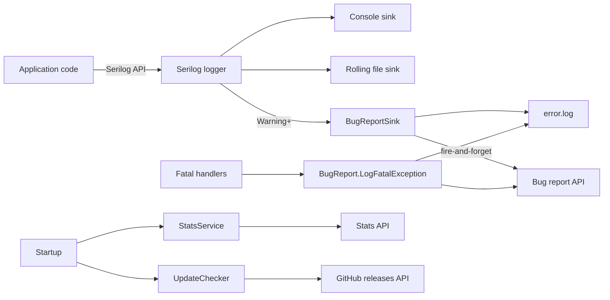

# Services

SimpleXisoDrive ships with a set of supporting services for logging, diagnostics, telemetry, and
update checks. This page documents each one and where its output ends up.

---

## LoggingSetup

`LoggingSetup.ConfigureLogger()` builds the global Serilog logger. It is called once at startup.

### Configuration

| Setting | Value |
| --- | --- |
| Minimum level | `Debug` |
| Console sink | Output template `[{Timestamp:HH:mm:ss} {Level:u3}] {Message:lj}{NewLine}{Exception}`, color theme `None` |
| File sink | `logs/simplexisodrive-.log` next to the executable, rolling daily, 7 files retained |
| File template | `{Timestamp:yyyy-MM-dd HH:mm:ss.fff zzz} [{Level:u3}] {Message:lj}{NewLine}{Exception}` |
| Bug report sink | Attached for `Warning` and above |

If logger configuration itself throws, the application continues with no logging rather than
failing to start.

### Log files

| File | Format | Contents |
| --- | --- | --- |
| `logs\simplexisodrive-YYYYMMDD.log` | Serilog text | Everything from Debug level up |
| `error.log` | Bug report blocks | Warning level and above, plus fatal exceptions |
| `critical_error.log` | Plain text | Failures inside the logging/reporting pipeline itself |

All paths are relative to the directory containing `SimpleXisoDrive.exe`.

### Typical log entries

```text
[HH:mm:ss INF] === SimpleXisoDrive Started ===
[HH:mm:ss INF] Arguments: D:\Games\Halo.iso | Z: | -l
[HH:mm:ss DBG] Resolved 'D:\Games\Halo' to 'D:\Games\Halo.iso'
[HH:mm:ss INF] Mount successful: 'D:\Games\Halo.iso' -> 'Z:'
[HH:mm:ss INF] Unmount signal received. Cleaning up...
[HH:mm:ss INF] Unmounted.
```

---

## ApiKeyProvider

`ApiKeyProvider` supplies the shared API key for the bug report and stats endpoints. The key is
never stored in plain text: two independent layers protect it in the assembly (an AES-256-CBC
outer layer over a SHA-256 XOR inner layer), and `Preload()` decrypts it once during startup.
Decryption failures are logged at Error level and disable remote reporting without affecting the
mount.

---

## SerilogDokanLogger

`SerilogDokanLogger` implements `DokanNet.Logging.ILogger` and forwards Dokan's internal messages to
Serilog:

| Dokan method | Serilog level |
| --- | --- |
| `Debug` | Debug |
| `Info` | Information |
| `Warn` | Warning |
| `Error` | Error |
| `Fatal` | Fatal |

`DebugEnabled` mirrors `Log.IsEnabled(LogEventLevel.Debug)` so Dokan can skip formatting when debug
logging is off.

---

## BugReport

`BugReport` is the local and remote reporting pipeline for warnings, errors, and crashes.

### Report content

`BuildReport` produces a text report with three sections:

1. **Environment details** - date/time with offset, application name and version, OS description,
   OS and process architecture, process/OS bitness, Windows version string, processor count, base
   directory, and temp path.
2. **Error details** - severity level and message.
3. **Exception details** - type, message, source, and stack trace (or `None` placeholders).

### Local logging

| Method | Destination | Behavior |
| --- | --- | --- |
| `WriteLocalErrorLog(report)` | `error.log` | Appends the report plus a separator, protected by a lock. Failure falls back to the critical log. |
| `LogFatalException(ex, context)` | `error.log` + console | Prints `--- CRITICAL CRASH ---`, writes the report, and starts a fire-and-forget API submission. |
| `WriteToCriticalLog(...)` (private) | `critical_error.log` | Last-resort logging when the normal pipeline fails. |

### Remote reporting

`SendToApiAsync` posts the report as JSON to the configured endpoint. The payload contains:

| Field | Value |
| --- | --- |
| `message` | The rendered report text |
| `applicationName` | `SimpleXisoDrive` |
| `version` | Assembly version |
| `userInfo` | `Environment.UserName` |
| `environment` | OS description and architecture |
| `stackTrace` | Exception `ToString()` or `No exception attached.` |

The request carries an API key header and uses a 30-second timeout. Non-success responses and
exceptions are written to `critical_error.log`. The static `HttpClient` is registered for disposal
on process exit and can also be disposed explicitly through `DisposeHttpClient`.

### When reports are sent

| Trigger | Path |
| --- | --- |
| Serilog event at Warning level or higher | `BugReportSink.Emit` |
| Unhandled exception on the main thread | `AppDomain.UnhandledException` -> `LogFatalException` |
| Unobserved task exception | `TaskScheduler.UnobservedTaskException` -> `LogFatalException` |

Update checker network failures are deliberately logged at Information level only and are **not**
forwarded. See [Privacy and Networking](Privacy-and-Networking) for the full data-flow description.

---

## BugReportSink

`BugReportSink` is a Serilog sink that connects the logging pipeline to `BugReport`.

| Property | Behavior |
| --- | --- |
| Threshold | Attached at `Warning`; ignores lower levels |
| Rate limit | Maximum 8 reports per minute per process (the API permits 10) |
| Local output | Every accepted report is appended to `error.log` |
| Remote output | Fire-and-forget `SendToApiAsync` on a background task |
| Failure policy | All exceptions are swallowed; a sink must never break logging |

Rate limiting uses a static queue of timestamps, trimmed to a one-minute window.

---

## CheckAccess

`CheckAccess.IsAdministrator()` uses `WindowsIdentity.GetCurrent()` and `WindowsPrincipal.IsInRole`
with `WindowsBuiltInRole.Administrator`.

- Returns `true` when the process is elevated.
- Returns `false` on non-Windows or on any exception (the failure is logged at Error level).

The result controls two behaviors:

1. **Dokan options** - `MountManager` is enabled only for elevated processes.
2. **Console warning** - mounting a drive letter without administrator rights prints a hint.

---

## StatsService

`StatsService.ReportLaunchAsync()` reports an anonymous launch event. It is fire-and-forget and never
blocks startup.

| Property | Value |
| --- | --- |
| Method | `POST` |
| Endpoint | `https://www.purelogiccode.com/ApplicationStats/stats` |
| Authentication | `Bearer` token header |
| Payload | `{ "applicationId": "simplexisodrive", "version": "<assembly version>" }` |
| Timeout | 10 seconds |
| Failure handling | Timeouts, connection failures, and other errors are logged at Debug level and ignored (never forwarded to the bug report API) |

No user, machine, or file information is included in this request.

---

## UpdateChecker

`UpdateChecker.CheckForUpdateAsync()` queries the GitHub releases API at startup.

| Step | Detail |
| --- | --- |
| Request | `GET https://api.github.com/repos/purelogiccode/SimpleXisoDrive/releases/latest` with `User-Agent: SimpleXisoDrive-UpdateChecker` |
| Timeout | 5 seconds |
| Parsing | Extracts `tag_name` and `html_url`, then matches `\d+\.\d+\.\d+` (1-second regex timeout) |
| Comparison | Newer than the running assembly version wins |
| Prompt | `Open the release page in your browser? [Y/n]`; pressing `n`/`N` cancels |
| Redirected input | The prompt is skipped entirely |
| Browser launch | Uses the default browser via shell execute |
| Failure handling | Logged at Information level only and never forwarded to the bug report API |

---

## Service interactions at a glance


